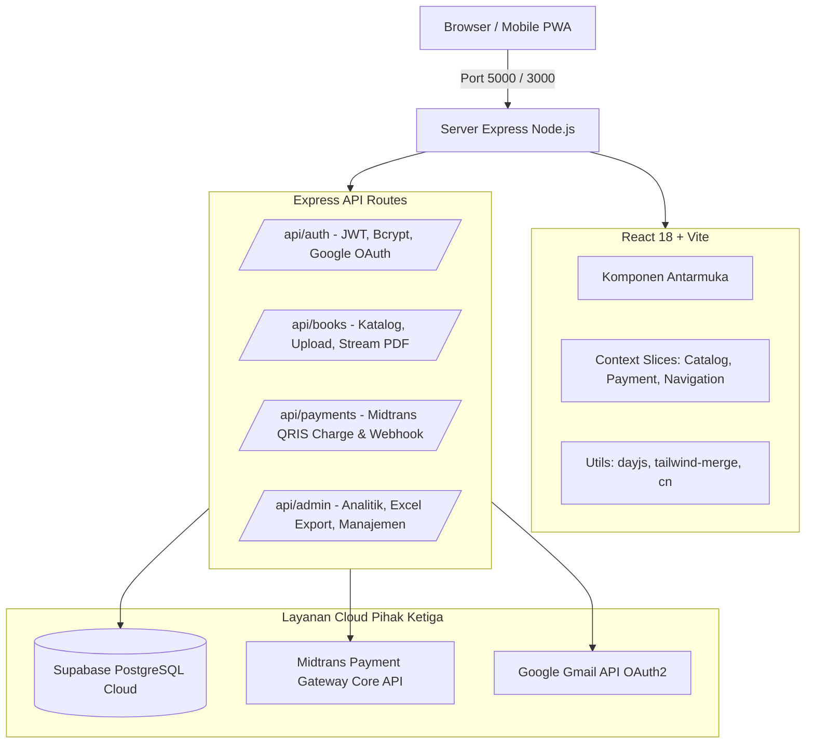

# 📖 Wahidiyah Book — Digital Library & Real Midtrans QRIS

[](https://nodejs.org/)
[](https://react.dev/)
[](https://expressjs.com/)
[](https://vitejs.dev/)
[](https://tailwindcss.com/)
[-emerald.svg)](https://supabase.com/)
[](https://midtrans.com/)

Perpustakaan digital modern berbasis web dengan katalog buku interaktif, pembaca PDF terproteksi, keanggotaan **Pro**, dan pembayaran **QRIS menggunakan Midtrans Core API (Sandbox)** sesungguhnya.

> 🎓 **Konteks Proyek Skripsi:**
> Repositori ini adalah implementasi sistem pembayaran **REAL MIDTRANS CORE API**.
> Seluruh transaksi pembayaran QRIS di-generate secara real-time melalui server Midtrans Engine, divalidasi keaslian tanda tangan digitalnya (*signature key*), dan diselesaikan secara idempoten di sisi backend.

---

## 📑 Daftar Isi
1. [Fitur Unggulan Sistem](#-fitur-unggulan-sistem)
2. [Arsitektur Sistem](#-arsitektur-sistem)
3. [Alur Pembayaran QRIS Midtrans](#-alur-pembayaran-qris-midtrans)
4. [Standar Keamanan Sistem (Security Hardening)](#-standar-keamanan-sistem-security-hardening)
5. [Prasyarat & Konfigurasi Lingkungan (.env)](#-prasyarat--konfigurasi-lingkungan-env)
6. [Panduan Instalasi & Setup Database](#-panduan-instalasi--setup-database)
7. [Panduan Menjalankan Aplikasi (NPM Scripts)](#-panduan-menjalankan-aplikasi-npm-scripts)
8. [Struktur Direktori Proyek](#-struktur-direktori-proyek)
9. [Histori Rilis & Rekam Jejak Kerja (Memory-Kerja R40–R50)](#-histori-rilis--rekam-jejak-kerja-memory-kerja-r40r50)

---

## ✨ Fitur Unggulan Sistem

### 1. Katalog Buku & E-Reader Terproteksi
- **Katalog Interaktif:** Pencarian cerdas, filter kategori, penanda buku populer, dan indikator status Pro (*locked* vs *free*).
- **Pembaca PDF Read-Only (Khusus Baca):**
  - Toolbar unduh browser dimatikan (`#toolbar=0&navpanes=0`).
  - Proteksi klik kanan (`onContextMenu preventDefault`) dan larangan seleksi (`select-none`).
  - Pengiriman konten berkas via header HTTP `Content-Disposition: inline` dengan otorisasi JWT.
- **Last Read Tracker (Ingat Halaman Terakhir):** Otomatis menyimpan progres membaca pengguna di `localStorage` dan menampilkan banner *"Lanjut membaca dari Halaman X?"*.
- **Mode Tema Pembaca:** Pilihan latar belakang **Terang**, **Sepia (Hangat)**, dan **Malam (Gelap)** untuk kenyamanan mata.

### 2. Autentikasi Pengguna & Keamanan Akun
- **Registrasi & Verifikasi OTP Email:** Verifikasi pendaftaran 6 digit OTP yang dikirim langsung melalui **Gmail API OAuth2** (berlaku 10 menit dengan proteksi cooldown kirim ulang 60 detik).
- **Login Akun Google:** Integrasi resmi Google Identity Services / Direct Google OAuth 2.0 dengan verifikasi integritas token ID.
- **Sesi Aman:** Penyimpanan kata sandi dengan salt hashing `bcrypt` (12 rounds) dan sesi berbasis token `jsonwebtoken` (JWT).

### 3. Sistem Keanggotaan Pro & Pembayaran Real Midtrans QRIS
- **Integrasi Midtrans Core API:** Charge QRIS dibuat langsung dari backend server dengan nominal dinamis (bebas dari manipulasi harga di sisi klien).
- **Simpan QRIS ke Galeri:** Konversi SVG EMVCo QRIS ke gambar PNG beresolusi tinggi via HTML5 Canvas agar dapat dipindai langsung dari galeri aplikasi e-wallet (DANA, GoPay, BCA, Livin, OVO).
- **Polling & Webhook Idempoten:** Pengecekan otomatis status transaksi setiap 3 detik dan verifikasi *SHA512 Signature Key* pada endpoint webhook notifikasi.
- **Kwitansi Pembayaran Resmi:** Faktur tanda terima digital berlogo resmi Wahidiyah Book yang siap cetak / simpan ke PDF.

### 4. Panel Administrasi Komprehensif
- **Manajemen Konten:** Unggah buku baru (thumbnail otomatis dikompresi ke format WebP via `sharp`), kelola kategori, dan deskripsi.
- **Dashboard Analitik:** Visualisasi tren pendapatan dan pertumbuhan pengguna baru menggunakan grafik kurva `recharts`.
- **Ekspor Laporan 1-Klik:** Unduh riwayat transaksi, data pengguna, dan katalog buku langsung ke format Microsoft Excel (`.xlsx`) via library `xlsx`.
- **Hero Carousel & Kalender Event:** Manajemen banner beranda dan jadwal agenda majelis.

### 5. Progressive Web App (PWA)
- Terintegrasi Web App Manifest & Service Worker.
- Banner otomatis untuk menginstal aplikasi ke Layar Utama (*Home Screen*) HP Android & panduan khusus Safari iOS.

---

## 🏛️ Arsitektur Sistem

Aplikasi dibangun menggunakan prinsip **arsitektur monolitik terpadu (Unified Single-Port Architecture)**:



- **Frontend:** Pure React 18, React Router v7, Vite 6, Tailwind CSS, Headless UI, Lucide Icons, Sonner.
- **Backend:** Node.js Express 4 (ES Module murni tanpa framework tambahan yang membebani).
- **State Management:** React Context API modular (`src/context/slices/`) dengan pemisahan domain logic yang bersih.

---

## 💳 Alur Pembayaran QRIS Midtrans

```
1. Pengguna memilih paket langganan Pro
   └──> Klien mengirim POST /api/payments/qris/charge

2. Server menghitung total biaya (Paket + Biaya Admin)
   └──> Memanggil Midtrans Core API (/v2/charge)
   └──> Midtrans mengembalikan qr_string (EMVCo) & URL QR PNG
   └──> Transaksi disimpan di Supabase berstatus 'pending'

3. Klien menampilkan QRIS Tajam & Tombol Simpan ke Galeri
   └──> Pengguna memindai QRIS via GoPay / BCA / DANA / Simulator

4. Penyelesaian Transaksi (Idempoten):
   ├── Jalur A: Webhook POST /api/payments/midtrans/notification
   │   └──> Validasi SHA512 signature key -> Status 'settlement' -> Pro aktif
   └── Jalur B: Polling Status GET /api/payments/qris/:id/status
       └──> Server memverifikasi status ke Midtrans Engine -> Pro aktif

5. Klien menampilkan Layar Sukses + Animasi Confetti + Cetak Kwitansi
```

---

## 🛡️ Standar Keamanan Sistem (Security Hardening)

Sistem telah diaudit berdasarkan **20 Indikator Pemeriksaan Keamanan Siber**:
1. **Perlindungan Password:** Bcrypt dengan salt cost 12 rounds.
2. **Otentikasi Statless:** Token JWT ditandatangani dengan secret berkekuatan tinggi dan masa kedaluwarsa ketat.
3. **Database RLS (Row Level Security):** Tabel Supabase dilindungi hak akses granular (anonim tidak bisa membaca data sensitif pengguna).
4. **Validasi Skema Terstruktur:** Menggunakan pustaka `zod` untuk memvalidasi seluruh input request sebelum diproses oleh database.
5. **Anti Brute-Force Rate Limiting:** Pembatasan frekuensi percobaan request pada endpoint otentikasi dan pembayaran QRIS.
6. **HTTP Header Hardening:** Integrasi `helmet` untuk proteksi terhadap serangan XSS, Clickjacking, dan sniffing tipe konten.
7. **Fail-Closed Webhook Guard:** Webhook Midtrans menolak seluruh request tanpa signature digital yang sah.
8. **Proteksi Hak Cipta PDF:** Nonaktifkan download toolbar, streaming inline, dan larangan context menu.

---

## ⚙️ Prasyarat & Konfigurasi Lingkungan (.env)

### 1. Prasyarat Sistem
- **Node.js:** Versi `>= 22.0.0`
- **NPM:** Versi `>= 10.0.0`
- **Akun Layanan Cloud:**
  - Akun [Supabase](https://supabase.com/) (Database PostgreSQL)
  - Akun [Midtrans Sandbox](https://dashboard.sandbox.midtrans.com/) (Payment Gateway)
  - Google Cloud Console Project (OAuth 2.0 Client ID & Secret)

### 2. Format Berkas `.env`
Salin template konfigurasi dari `.env.example` ke `.env`:

```env
# Port Server
PORT=5000
VITE_PORT=3000

# Konfigurasi Midtrans Sandbox
MIDTRANS_SERVER_KEY=SB-Mid-server-xxxxxxxxxxxxxxxxxxxx
MIDTRANS_CLIENT_KEY=SB-Mid-client-xxxxxxxxxxxxxxxxxxxx
MIDTRANS_IS_PRODUCTION=false
MIDTRANS_QRIS_ACQUIRER=gopay
MIDTRANS_QRIS_EXPIRY_MINUTES=15

# Konfigurasi Supabase Cloud
SUPABASE_URL=https://xxxxxxxxxxxxxxxxxxxx.supabase.co
SUPABASE_ANON_KEY=eyJhbGciOi...
SUPABASE_SERVICE_ROLE_KEY=eyJhbGciOi...

# Keamanan Sesi JWT
JWT_SECRET=rahasia-kunci-jwt-anda-minimal-32-karakter
JWT_EXPIRES_IN=12h

# Google OAuth & Gmail OTP API
GOOGLE_CLIENT_ID=xxxxxxxxxxxx.apps.googleusercontent.com
GOOGLE_CLIENT_SECRET=GOCSPX-xxxxxxxxxxxx
GMAIL_SENDER=email-pengirim@gmail.com
GMAIL_REFRESH_TOKEN=1//04xxxxxxxxxxxx
```

---

## 🚀 Panduan Instalasi & Setup Database

### 1. Kloning & Pemasangan Dependensi
```bash
git clone https://github.com/daffa-789/Wahidiyah-Book-Midtrans.git
cd "Wahidiyah Book + Real Midtrans Skripsi"
npm install
```

### 2. Migrasi Skema Database Supabase
Buka dasbor **Supabase** ➔ pilih project Anda ➔ masuk ke menu **SQL Editor** ➔ salin dan jalankan seluruh isi berkas:
```
supabase_database/full_setup.sql
```
Skrip ini akan secara otomatis membuat tabel `users`, `books`, `subscriptions`, `transactions`, `email_verifications`, `events`, `hero_slides`, fungsi trigger, serta aturan keamanan Row Level Security (RLS).

---

## 💻 Panduan Menjalankan Aplikasi (NPM Scripts)

Proyek ini telah dilengkapi dengan skrip otomatisasi modern di `package.json`:

| Perintah Terminal | Peran & Deskripsi |
| :--- | :--- |
| **`npm run dev`** | **Mode Pengembangan (Harian):** Menjalankan backend Express dan frontend Vite sekaligus dalam 1 port terpadu dengan Hot Module Replacement (HMR). |
| **`npm start`** | **Mode Produksi (Siap Rilis):** Otomatis mem-build aset ke folder `dist/` lalu menyalakan server produksi di port 5000. |
| **`npm run health`** | **Uji Kesehatan Sistem (5/5 Checklist):** 1-klik periksa koneksi Cloud Supabase, tabel-tabel utama, dan status payment gateway Midtrans. |
| **`npm run check`** | **Validasi Integritas Kode:** Memeriksa sintaks server Node.js dan memastikan kompilasi bundle frontend 0 error. |
| **`npm run clean:ports`** | **Bebaskan Port Windows:** Menghentikan proses node yang macet di port 3000 / 5000 jika terminal tertutup paksa. |
| **`npm run build`** | Mengompilasi kode sumber React menjadi berkas statis siap saji di folder `dist/`. |
| **`npm run gmail:token`** | Wizard interaktif untuk mendapatkan refresh token Gmail API guna pengiriman OTP. |
| **`npm run audit:security`** | Memindai seluruh dependensi paket terhadap potensi celah keamanan. |

---

## 📁 Struktur Direktori Proyek

```
Wahidiyah Book + Real Midtrans Skripsi/
├── public/                 # Aset statis publik (manifest PWA, ikon, favicon)
├── scripts/                # Otomasi skrip (dev, start, health-check, clean-ports)
│   ├── clean-ports.js      # Pembebas port soket Windows
│   ├── dev.js              # Runner server pengembangan satu port
│   ├── health-check.js     # Skrip 1-klik verifikasi kesehatan database & gateway
│   └── start.js            # Runner server produksi terpadu
├── server/                 # Backend Node.js Express (ESM)
│   ├── lib/                # Logika bisnis (midtrans, http, images, time, validate)
│   ├── middleware/         # Middleware upload multer & rate-limiter
│   ├── routes/             # Rute modular (auth, books, payments, admin, users)
│   ├── auth.js             # Otentikasi JWT & Bcrypt
│   ├── config.js           # Konfigurasi sistem & konstanta lingkungan
│   ├── db.js               # Inisialisasi klien Supabase server
│   ├── logger.js           # Logger konsol performa tinggi via picocolors
│   ├── mailer.js           # Pengirim email OTP via Gmail API OAuth2
│   └── server.js           # Titik masuk utama server Express
├── src/                    # Frontend React 18 (Vite)
│   ├── components/         # Komponen UI global & Banner PWA
│   ├── context/            # AppContext & Modular Slices (catalog, payment, nav)
│   ├── features/           # Halaman per fitur (home, reader, payment, admin, auth)
│   │   ├── admin/          # Panel admin & ekspor laporan Excel
│   │   ├── auth/           # Formulir login, register, dan verifikasi OTP
│   │   ├── payment/        # Layar QRIS, konversi PNG galeri, dan modal kwitansi
│   │   └── reader/         # Layar pembaca PDF, tema mode malam, dan resume tracker
│   ├── lib/                # Helper klien (api, utils, cn, dayjs, format)
│   ├── App.jsx             # Router navigasi utama
│   └── main.jsx            # Entry point React DOM
├── supabase_database/      # Skrip DDL & patch PostgreSQL Supabase
│   └── full_setup.sql      # Skrip master database terpadu
├── docs/                   # Dokumentasi arsitektur, API, dan alur pembayaran
├── package.json            # Manifest dependensi & skrip proyek
└── README.md               # Dokumentasi utama proyek
```

---

## 📓 Histori Rilis & Rekam Jejak Kerja (Memory-Kerja R40–R50)

Seluruh milestone pengembangan telah diselesaikan dan tercatat secara transparan pada folder `memory-kerja/`:

| Rilis | Tanggal | Ruang Lingkup & Pencapaian | Status |
| :---: | :---: | :--- | :---: |
| **R40** | 30 Sep 2026 | Penyelesaian utang teknis R37, penanganan kegagalan GIS, dan konsolidasi dependensi atomik. | ✅ Selesai |
| **R41** | 30 Sep 2026 | Refaktor penanggalan WIB, implementasi sistem pengingat jatuh tempo, dan eliminasi slot iklan. | ✅ Selesai |
| **R42** | 01 Okt 2026 | Arsitektur Single-Port (Vite middleware di dalam Express), sentralisasi SQL, dan request timeout. | ✅ Selesai |
| **R43** | 01 Okt 2026 | Penataan panel admin, eliminasi tab redundan, dan konfigurasi resmi pengirim email Gmail API. | ✅ Selesai |
| **R44** | 02 Okt 2026 | Migrasi `.mjs` ke `.js`, stabilisasi registrasi akun email baru, dan pembenahan header MIME. | ✅ Selesai |
| **R45** | 03 Okt 2026 | Penutupan celah keamanan P0, pengetatan paywall buku Pro, dan isolasi akses konten. | ✅ Selesai |
| **R46** | 03 Okt 2026 | Penyegaran antarmuka otentikasi dan penambahan jeda cooldown kirim ulang kode OTP 60 detik. | ✅ Selesai |
| **R47** | 03 Okt 2026 | Integrasi autentikasi Google Sign-In via Supabase Auth redirect callback. | ✅ Selesai |
| **R48** | 03 Okt 2026 | Pemindahan alur Google OAuth langsung (*Direct OAuth 2.0*) untuk stabilitas tanpa pihak ketiga. | ✅ Selesai |
| **R49** | 04 Okt 2026 | Pengecekan pre-launch komprehensif, fitur Hero Carousel banner dinamis, dan pembersihan kode mati. | ✅ Selesai |
| **R50** | 05–07 Okt 2026 | Audit keamanan RLS Supabase, redaksi kredensial git, standarisasi Pure React & Express (penghapusan total `server/services/`), dekomposisi `AppContext` ke modular slices, integrasi library standar (`dayjs`, `zod`, `tailwind-merge`, `picocolors`), proteksi PDF read-only, dan pembuatan skrip `health-check`. | ✅ Selesai |

---

## 👨‍💻 Pengembang

- **Peneliti / Pengembang:** Daffa
- **Topik Skripsi:** Sistem Perpustakaan Digital Wahidiyah dengan Keanggotaan Pro dan Pembayaran QRIS via Midtrans Core API
- **Lisensi:** Private / Skripsi Project (Hak Cipta Dilindungi)
