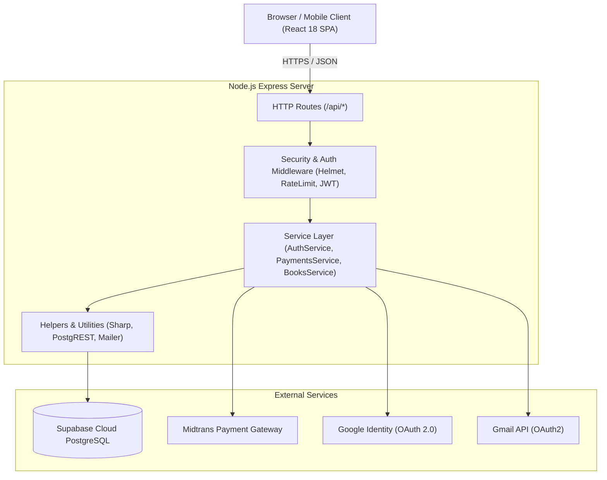
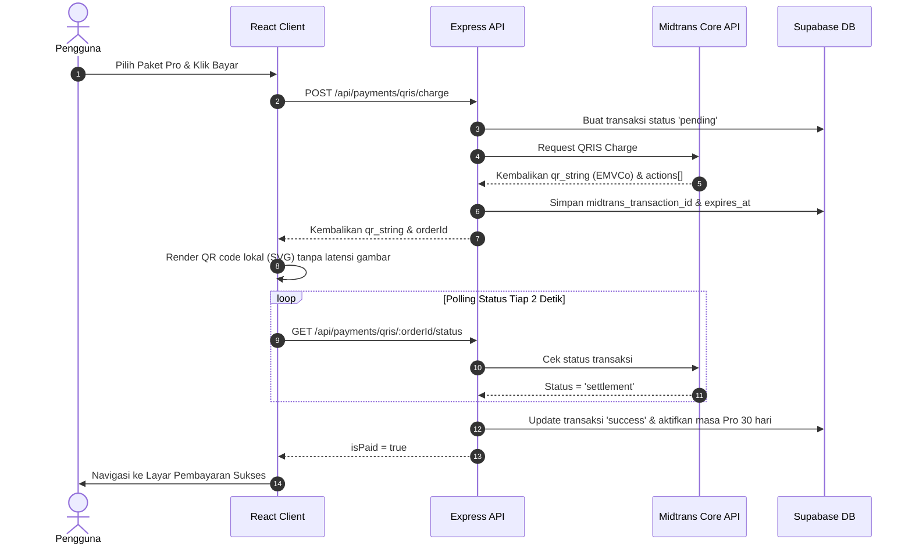

# Arsitektur Sistem — Aplikasi Buku Wahidiyah

Dokumen ini menjelaskan arsitektur perangkat lunak, pola desain (*design patterns*), struktur folder, aliran data, dan standar keamanan yang diterapkan pada aplikasi **Wahidiyah Book**.

---

## 1. Ringkasan Eksekutif & Tech Stack

Aplikasi ini dibangun menggunakan arsitektur **Client-Server Terpisah (Decoupled Single Page Application)** yang dapat dijalankan dalam mode mandiri (*monolithic runtime*) maupun terpisah:

* **Frontend:** React 18, Vite, React Router v7, Tailwind CSS, Headless UI, Lucide Icons, Sonner.
* **Backend:** Node.js (v20+ / v22+), Express.js 4.
* **Database & BaaS:** Supabase Cloud (PostgreSQL 15 dengan *Row Level Security*).
* **Payment Gateway:** Midtrans Core API (QRIS Sandbox/Production).
* **Image Processing:** Sharp (kompresi & sanitasi gambar WebP).
* **Email & Notifikasi:** Google OAuth2 API (Gmail API HTTPS).

---

## 2. Diagram Arsitektur Tingkat Tinggi



---

## 3. Struktur Folder Modular

Codebase mengikuti arsitektur modular berbasis fitur (*feature-based*) di frontend dan arsitektur berlapis (*layered service-oriented architecture*) di backend:

```text
├── docs/                   # Dokumentasi teknis & spesifikasi API
├── public/                 # Aset statis publik (logo, favicon, PWA manifest)
├── server/                 # Backend Node.js Express
│   ├── lib/                # Helper murni (constants, crypto, http, images, validate)
│   ├── middleware/         # Express middleware (security, errors, requestLog, uploads)
│   ├── routes/             # HTTP Route definitions (controller endpoints)
│   ├── services/           # Logika bisnis & integrasi eksternal (Service Layer)
│   ├── auth.js             # Sesi JWT, hashing password, otorisasi role
│   ├── config.js           # Konfigurasi terpusat & env mapping
│   ├── db.js               # Inisialisasi koneksi Supabase Server SDK
│   └── server.js           # Entrypoint Express server
├── src/                    # Frontend React 18 SPA
│   ├── components/         # Komponen umum & UI reusable (DeviceFrame, Modal, dll)
│   ├── context/            # Global State (AppProvider & Slices)
│   │   └── slices/         # Modular hooks: useCatalogSlice, usePaymentSlice, useNavigationSlice
│   ├── features/           # Modul fitur aplikasi
│   │   ├── admin/          # Panel kontrol admin (Buku, Carousel, Agenda, Logs)
│   │   ├── auth/           # Login, Register, OTP Verify, Forgot Password
│   │   ├── calendar/       # Agenda dan jadwal kegiatan
│   │   ├── home/           # Beranda, Hero Carousel, Katalog Buku
│   │   ├── payment/        # Alur checkout, rendering QRIS SVG, konfirmasi
│   │   ├── profile/        # Profil pengguna, ganti password, riwayat langganan
│   │   └── reader/         # Pembaca buku PDF digital
│   ├── lib/                # Klien HTTP (apiJson), normalizer, utility tanggal/angka
│   ├── App.jsx             # Router aplikasi & perlindungan rute (Guards)
│   └── main.jsx            # Entrypoint React DOM
└── supabase_database/      # Skema database & DDL PostgreSQL (full_setup.sql)
```

---

## 4. Aliran Data Utama (Key Data Flows)

### A. Alur Otentikasi Pengguna (Email/Password & OTP)
1. Pengguna mengisi form pendaftaran di `RegisterScreen`.
2. Frontend mengirim `POST /api/auth/register`.
3. `auth.service.js` memvalidasi input, membuat hash password sementara via `bcrypt`, dan menerbitkan OTP 6-digit.
4. Kode OTP dikirim ke email via Gmail API (atau ditampilkan di layar pengujian jika mode demo).
5. Pengguna memasukkan OTP di `VerifyEmailScreen` (`POST /api/auth/verify-registration`).
6. Server memverifikasi OTP, membuat baris pengguna baru di tabel `users`, dan menerbitkan JWT token.
7. Token disimpan di `localStorage` klien untuk header otentikasi `Authorization: Bearer <token>`.

### B. Alur Pembayaran QRIS Midtrans


---

## 5. Matriks Keamanan & Best Practices

1. **Prinsip Fail-Closed:** Verifikasi tanda tangan SHA-512 Midtrans (`signature_key`) menolak request jika ada ketidaksesuaian nominal atau hash.
2. **Idempotent Updates:** Aktivasi status langganan menggunakan kueri bersyarat `WHERE id = ? AND status = 'pending'`, mencegah aktivasi ganda dari polling dan webhook.
3. **Penyembunyian Rahasia:** Kunci rahasia (`MIDTRANS_SERVER_KEY`, `SUPABASE_SECRET_KEY`, `JWT_SECRET`) tidak pernah dikirim ke browser atau diekspos di frontend.
4. **Sanitasi File Unggahan:** Gambar sampul diproses ulang lewat `sharp` sebelum disimpan, menghilangkan potensi injeksi skrip di metadata gambar.
5. **Row Level Security:** Seluruh tabel database dilindungi kebijakan RLS PostgreSQL di Supabase.
